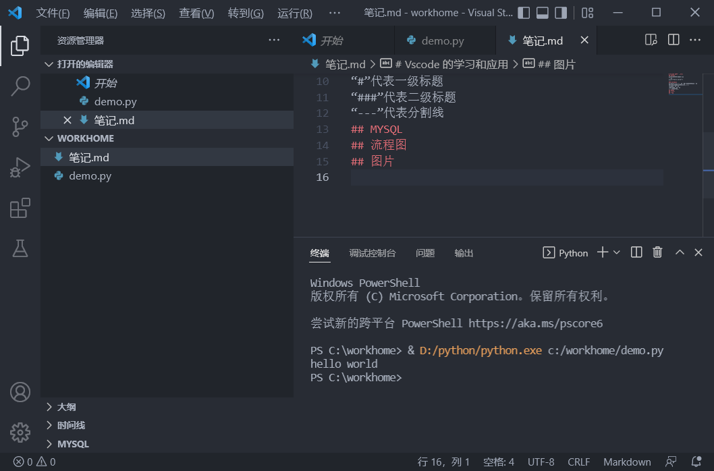
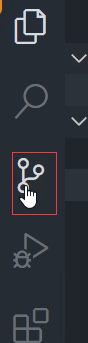

# Vscode 的学习和应用
## python
python的文件后缀名是py
```py
print("hello world!")
```
### markdown
markdown是当前流行的一种用来写文档的语言。
可以快捷的生产漂亮的排版和格式
“#”代表一级标题
“###”代表二级标题
“---”代表分割线
## MYSQL
## 流程图
## 图片
粘贴的快捷键是
ctrl+alt+v
就可以把复制的图片直接粘贴过来

## git使用
1、先设置名称： git config --global user.name "zzf123" <br>
2、再设置github邮箱： git config --global user.email  "904585006@qq.com" <br>
3、打开github官网并登录，点击右上角头像下的setting，点击“SSH and GPG KEY” 然后输入$ ssh-keygen -t rsa -C "904585006@qq.com"再连续三次回车，生成文件 <br>
4、打开c/user/用户名/.shh，找到生成的文件，打开文件id_rsa.pub，复制其中的内容<br>
5、在github的SSH and GPG KEY页面下，点击【new SSH key】,将复制的内容输入，点击【确认】<br>
6、在git命令框输入：ssh -T git@github.com，输入yes，返回成功既可<br>
7、回到github网站，点击头像下的“your profile”，点击右上角“+”，点击【new repository】输入仓库名字，勾选readme,点击【create repository】<br>
8、复制页面上的SSH路径“git@github.com:zzftest01/zzfhub.git”，回到git命令框，输入给git clone git@github.com:zzftest01/zzfhub.git,回车//本质上是拉取项目 <br> 
9、回到项目文件下，查看是否下载文件下来<br>
10、打开下载下来的文件“zzfhome”，复制其下的文件夹.git(隐藏)到项目文件根目录下<br>
11、在vscode里，点击【设置】，搜索git path，点击【在settings.json】,输入git的路径C:\\Program Files\\Git\\bin\\git.exe,保存，重启vscode<br>
12、点击vscode的【源代码管理】，点击【+】，在消息中输入“测试”，点击“✔”，点击“...”，点击“推送到”，选择git路径<br>，即可推送成功


